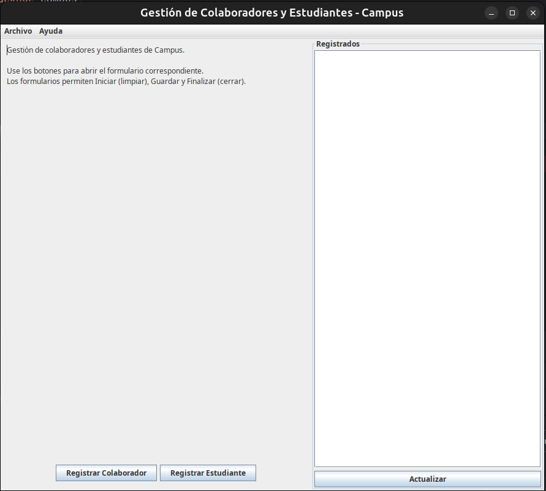
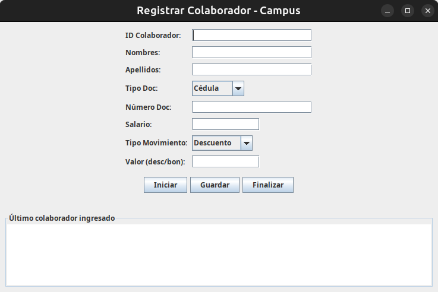
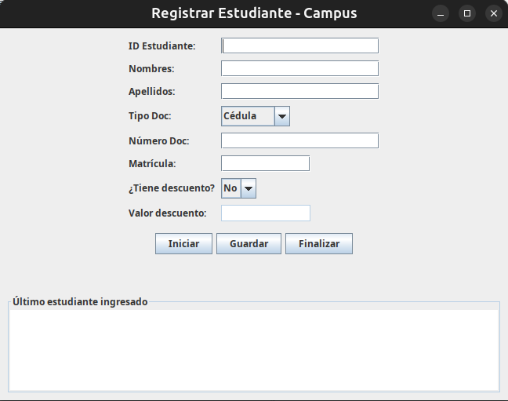

# CAMPUSManagement

CAMPUSManagement es un proyecto educativo realizado en Java, que utiliza la biblioteca Swing para crear una interfaz gráfica básica. La aplicación permite registrar colaboradores y estudiantes, mostrando sus datos en pantalla mediante ventanas independientes. Es ideal para quienes están aprendiendo Java y desean practicar el desarrollo de interfaces gráficas y la gestión básica de datos.

## Características principales

- Registro de colaboradores y estudiantes mediante formularios gráficos.
- Visualización sencilla y ordenada de los registros en ventanas independientes.
- Interfaz completamente desarrollada en Swing.
- Proyecto básico ideal para prácticas educativas de Java y POO.

## Capturas de pantalla

A continuación puedes ver ejemplos de la interfaz y ventanas de la aplicación:

<p align="center">
  
</p>
<p align="center">
  
</p>
<p align="center">
  
</p>

## Instalación y uso

1. Clona este repositorio:
    ```bash
    git clone https://github.com/DevManuelGalvis/CAMPUSManagement.git
    cd CAMPUSManagement
    ```
2. Abre el proyecto en tu IDE de preferencia (por ejemplo, IntelliJ IDEA, Eclipse o NetBeans).
3. Asegúrate de tener Java instalado (Java 8 o superior).
4. Compila y ejecuta la aplicación desde tu IDE o usando la terminal:
    ```bash
    javac Main.java
    java Main
    ```
   _(Reemplaza `Main.java` por el archivo principal si tiene otro nombre)_

## Tecnologías utilizadas

- **Lenguaje:** Java
- **Interfaz gráfica:** Swing
- **IDE recomendado:** IntelliJ IDEA, Eclipse, NetBeans (cualquiera compatible con Java)
- **Propósito:** Proyecto educativo de práctica

## Contribución

Este es un proyecto educativo, pero si tienes ideas o quieres hacer mejoras, ¡eres bienvenido! Haz un fork del repositorio y envía un pull request.

## Licencia

Este proyecto es de libre uso con fines educativos.

---

Desarrollado por [DevManuelGalvis](https://github.com/DevManuelGalvis)